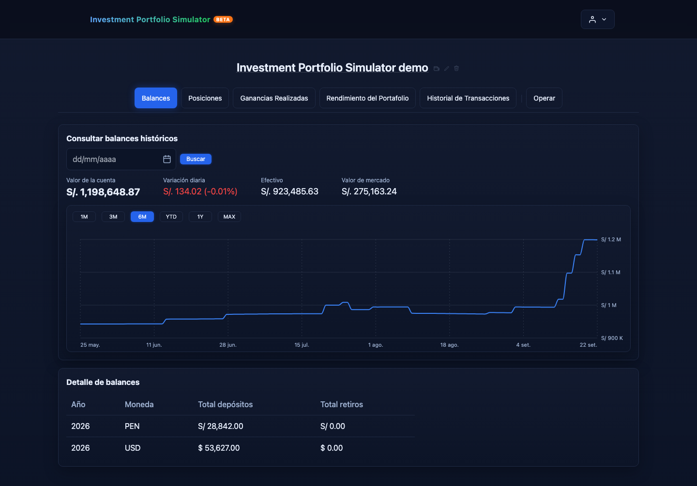

# Investment Portfolio Simulator

A full-stack investment portfolio simulator for Peruvian and U.S. markets. It tracks simulated trades, PEN/USD cash wallets, cost basis, and historical portfolio performance through a React client and a Django API.

[](https://github.com/Pumpurri/investment-portfolio-simulator/actions/workflows/ci.yml) · [Read-only preview](https://bolsasim.com/preview) · [Run locally](docs/development.md)

> **Try it:** Explore the fictional, [read-only preview](https://bolsasim.com/preview). Interactive registration, trading, and current quotes are intentionally offline.



*The actual authenticated app, captured from a disposable local account with generated trades and prices. This is neither a live portfolio nor current market data.*

## Engineering highlights

- **Trade-time FX:** [transaction settlement](backend/portfolio/services/transaction_service.py) records native execution prices and the FX rate used for PEN/USD trades. [Trade replay](backend/portfolio/services/trade_basis_service.py) reconstructs base-currency holdings and realized P&L; it rejects missing rates rather than guessing them. [Tests](backend/portfolio/tests/services/test_trade_basis_service.py)
- **Historical valuation:** [snapshots](backend/portfolio/services/snapshot_service.py) rebuild PEN and USD cash separately from transactions, then value both wallets at the snapshot date. [Tests](backend/portfolio/tests/services/test_snapshot_service.py)
- **Scheduled data work:** Celery ingests prices, FX rates, and benchmarks and updates snapshots. Quotes are labeled by refresh status, not advertised as a real-time market feed.
- **Verification:** CI runs backend and frontend tests, dependency audits, an authenticated browser flow that places a paper trade, and an isolated PostgreSQL operational smoke test. [Workflow](.github/workflows/ci.yml)

## Architecture

```text
React / Vite client
       │ authenticated REST requests
       ▼
Django API ──────────────── PostgreSQL
       │ background work
       ▼
Redis ◀── Celery worker / beat ──▶ BVL, FMP, BCRP
```

The Django apps are [`users`](backend/users), [`stocks`](backend/stocks), and [`portfolio`](backend/portfolio). The frontend lives in [`frontend/`](frontend). The public [preview](https://bolsasim.com/preview) is a separate illustrative screen; it does not call the paused backend.

## Explore the project

- [Local setup and disposable showcase data](docs/development.md)
- [Deployment runbook](RAILWAY_DEPLOYMENT.md) — services remain paused
- [Maintenance and cost-basis audit](docs/maintenance.md) — dry-run first
- [Observability setup](backend/OBSERVABILITY.md)

This is an educational simulator: it executes no real trades and provides no investment advice. Its time-weighted return is an estimate based on end-of-day valuations, not exact intraday TWR.
